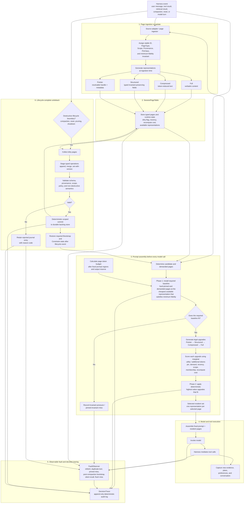

# ClawVM Architecture

This document summarizes the end-to-end flow described in the
[ClawVM paper](https://arxiv.org/abs/2604.10352). Solid component names are
paper concepts; the C++ implementation is currently focused on `Page`,
`PageTypePolicy`, and representation storage.

## Key distinction

- **Ingestion** creates or updates the available representations. It may parse,
  compress, count tokens, and store durable artifacts.
- **Selection** does not generate representations under budget pressure. It only
  chooses among variants already stored in the page table.
- **Phase 1** establishes the cheapest safe resident set.
- **Phase 2** spends the remaining token budget on higher-value fidelity.
- **Writeback** protects dirty state before a lifecycle operation can destroy
  the only current copy.

## Current C++ implementation boundary

Implemented or in progress:

- `PageType`, `Fidelity`, `PinClass`, and `Scope`
- `PageTypePolicy` and legal degradation paths
- `Page` representation validation and storage

Still to implement:

- minimum-viable representation lookup
- page ingestion and representation generation
- `SessionPageTable`
- two-phase `RepresentationSelector`
- `FaultObserver` and `DecisionTrace`
- `WritebackJournal`
- lifecycle orchestration in `ClawVMEngine`
